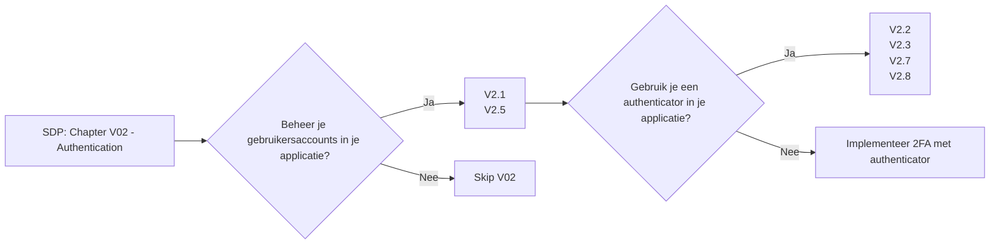

# Chapter V02 - Authentication

Het hoofdstuk "V02 - Authentication" van de SDP gaat over ervoor zorgen dat alleen de juiste mensen toegang krijgen tot je applicatie. Het helpt je de beste methoden te gebruiken om gebruikers te identificeren en te controleren of ze echt zijn wie ze zeggen dat ze zijn.

Simpel gezegd betekent dit onder andere:

* **Sterke Wachtwoorden**: Gebruik sterke, unieke wachtwoorden en moedig gebruikers aan om hetzelfde te doen.
* **Multi-factor Authenticatie**: Voeg een extra beveiligingslaag toe door bijvoorbeeld een code naar de telefoon van de gebruiker te sturen naast het wachtwoord.
* **Veilige Inlogprocedures**: Zorg dat het inlogsysteem goed is beveiligd tegen aanvallen zoals brute force en phishing.

Dit hoofdstuk helpt je om robuuste en betrouwbare methoden voor gebruikersauthenticatie te implementeren, zodat je applicatie beschermd is tegen ongeautoriseerde toegang.

Om te controleren of dit hoofdstuk van toepassing is op jouw project, gebruik deze workflow:

## V2.1 Password Security

### Baseline

Voor meer informatie zie: [V2.1 Password Security](./V2.1%20Password%20Security.md)

| ID     | Description |
| ------ | ----------- |
| 2.1.1  | Verify that user set passwords are at least 12 characters in length (after multiple spaces are combined). |
| 2.1.2  | Verify that passwords of at least 64 characters are permitted, and that passwords of more than 128 characters are denied. |
| 2.1.3  | Verify that password truncation is not performed. However, consecutive multiple spaces may be replaced by a single space. |
| 2.1.4  | Verify that any printable Unicode character, including language neutral characters such as spaces and Emojis are permitted in passwords |
| 2.1.5  | Verify users can change their password. |
| 2.1.6  | Verify that password change functionality requires the user's current and new password. |
| 2.1.7  | Verify that passwords submitted during account registration, login, and password change are checked against a set of breached passwords either locally (such as the top 1,000 or 10,000 most common passwords which match the system's password policy) or using an external API. If using an API a zero knowledge proof or other mechanism should be used to ensure that the plain text password is not sent or used in verifying the breach status of the password. If the password is breached, the application must require the user to set a new non-breached password. |
| 2.1.8  | Verify that a password strength meter is provided to help users set a stronger password. |
| 2.1.9  | Verify that there are no password composition rules limiting the type of characters permitted. There should be no requirement for upper or lower case or numbers or special characters. |
| 2.1.10 | Verify that there are no periodic credential rotation or password history requirements. |
| 2.1.11 | Verify that "paste" functionality, browser password helpers, and external password managers are permitted. |
| 2.1.12 | Verify that the user can choose to either temporarily view the entire masked password, or temporarily view the last typed character of the password on platforms that do not have this as built-in functionality. |

### Enhanced

Dit item heeft geen Level 2 items.

### Advanced

Dit item heeft geen Level 3 items.

## V2.2 General Authenticator Security

### Baseline

Voor meer informatie zie: [V2.2 General Authenticator Security](./V2.2%20General%20Authenticator%20Security.md)

| ID    | Description |
| ----- | ----------- |
| 2.2.1 | Verify that anti-automation controls are effective at mitigating breached credential testing, brute force, and account lockout attacks. Such controls include blocking the most common breached passwords, soft lockouts, rate limiting, CAPTCHA, ever increasing delays between attempts, IP address restrictions, or risk-based restrictions such as location, first login on a device, recent attempts to unlock the account, or similar. Verify that no more than 100 failed attempts per hour is possible on a single account. |
| 2.2.2 | Verify that the use of weak authenticators (such as SMS and email) is limited to secondary verification and transaction approval and not as a replacement for more secure authentication methods. Verify that stronger methods are offered before weak methods, users are aware of the risks, or that proper measures are in place to limit the risks of account compromise. |
| 2.2.3 | Verify that secure notifications are sent to users after updates to authentication details, such as credential resets, email or address changes, logging in from unknown or risky locations. The use of push notifications - rather than SMS or email - is preferred, but in the absence of push notifications, SMS or email is acceptable as long as no sensitive information is disclosed in the notification. |

### Enhanced

Dit item heeft geen Level 2 items.

### Advanced

| ID | Description |
|-------|----------------------------------------------------------------------------------------------------------------------------------------------------------------------------------------------------------------------------------------------|
| 2.2.4 | Verify impersonation resistance against phishing, such as the use of multi-factor authentication, cryptographic devices with intent (such as connected keys with a push to authenticate), or at higher AAL levels, client-side certificates. |
| 2.2.5 | Verify that where a Credential Service Provider (CSP) and the application verifying authentication are separated, mutually authenticated TLS is in place between the two endpoints. |
| 2.2.6 | Verify replay resistance through the mandated use of One-time Passwords (OTP) devices, cryptographic authenticators, or lookup codes. |
| 2.2.7 | Verify intent to authenticate by requiring the entry of an OTP token or user-initiated action such as a button press on a FIDO hardware key. |

## V2.3 Authenticator Lifecycle

### Baseline

Voor meer informatie zie: [V2.3 Authenticator Lifecycle](./V2.3%20Authenticator%20Lifecycle.md)

| ID    | Description |
| ----- | ----------- |
| 2.3.1 | Verify system generated initial passwords or activation codes SHOULD be securely randomly generated, SHOULD be at least 6 characters long, and MAY contain letters and numbers, and expire after a short period of time. These initial secrets must not be permitted to become the long term password. |

### Enhanced

| ID    | Description |
| ----- | ----------- |
| 2.3.2 | Verify that enrollment and use of user-provided authentication devices are supported, such as a U2F or FIDO tokens. |
| 2.3.3 | Verify that renewal instructions are sent with sufficient time to renew time bound authenticators. |

### Advanced

Dit item heeft geen Level 3 items.

## V2.4 Credential Storage

### Baseline

Dit item heeft geen Level 1 items.

### Enhanced

| ID    | Description |
| ----- | ----------- |
| 2.4.1 | Verify that passwords are stored in a form that is resistant to offline attacks. Passwords SHALL be salted and hashed using an approved one-way key derivation or password hashing function. Key derivation and password hashing functions take a password, a salt, and a cost factor as inputs when generating a password hash. |
| 2.4.2 | Verify that the salt is at least 32 bits in length and be chosen arbitrarily to minimize salt value collisions among stored hashes. For each credential, a unique salt value and the resulting hash SHALL be |
| 2.4.3 | Verify that if PBKDF2 is used, the iteration count SHOULD be as large as verification server performance will allow, typically at least 100,000 iterations. |
| 2.4.4 | Verify that if bcrypt is used, the work factor SHOULD be as large as verification server performance will allow, with a minimum of 10. |
| 2.4.5 | Verify that an additional iteration of a key derivation function is performed, using a salt value that is secret and known only to the verifier. Generate the salt value using an approved random bit generator [SP 800-90Ar1] and provide at least the minimum security strength specified in the latest revision of SP 800-131A. The secret salt value SHALL be stored separately from the hashed passwords (e.g., in a specialized device like a hardware security module). |

### Advanced

Dit item heeft geen Level 3 items.

## V2.5 Credential Recovery

### Baseline

Voor meer informatie zie: [V2.5 Credential Recovery](./V2.5%20Credential%20Recovery.md)

| ID    | Description |
| ----- | ----------- |
| 2.5.1 | Verify that a system generated initial activation or recovery secret is not sent in clear text to the user. |
| 2.5.2 | Verify password hints or knowledge-based authentication (so-called "secret questions") are not present. |
| 2.5.3 | Verify password credential recovery does not reveal the current password in any way. |
| 2.5.4 | Verify shared or default accounts are not present (e.g. "root", "admin", or "sa"). |
| 2.5.5 | Verify that if an authentication factor is changed or replaced, that the user is notified of this event. |
| 2.5.6 | Verify forgotten password, and other recovery paths use a secure recovery mechanism, such as time-based OTP (TOTP) or other soft token, mobile push, or another offline recovery mechanism. |

### Enhanced

V2.5.7 Verify that if OTP or multi-factor authentication factors are lost, that evidence of identity proofing is performed at the same level as during enrollment.

### Advanced

Dit item heeft geen Level 3 items.

## V2.6 Look-up Secret Verifier

### Baseline

Dit item heeft geen Level 1 items.

### Enhanced

| ID    | Description |
| ----- | ----------- |
| 2.6.1 | Verify that lookup secrets can be used only once. |
| 2.6.2 | Verify that lookup secrets have sufficient randomness (112 bits of entropy), or if less than 112 bits of entropy, salted with a unique and random 32-bit salt and hashed with an approved one-way hash. |
| 2.6.3 | Verify that lookup secrets are resistant to offline attacks, such as predictable values. |

### Advanced

Dit item heeft geen Level 3 items.

## V2.7 Out of Band Verifier

### Baseline

Voor meer informatie zie: [V2.7 Out of Band Verifier](./V2.7%20Out%20of%20Band%20Verifier.md)

| ID    | Description |
| ----- | ----------- |
| 2.7.1 | Verify that clear text out of band (NIST "restricted") authenticators, such as SMS or PSTN, are not offered by default, and stronger alternatives such as push notifications are offered first. |
| 2.7.2 | Verify that the out of band verifier expires out of band authentication requests, codes, or tokens after 10 minutes. |
| 2.7.3 | Verify that the out of band verifier authentication requests, codes, or tokens are only usable once, and only for the original authentication request. |
| 2.7.4 | Verify that the out of band authenticator and verifier communicates over a secure independent channel. |

### Enhanced

| ID    | Description |
| ----- | ----------- |
| 2.7.5 | Verify that the out of band verifier retains only a hashed version of the authentication code. |
| 2.7.6 | Verify that the initial authentication code is generated by a secure random number generator, containing at least 20 bits of entropy (typically a six digital random number is sufficient). |

### Advanced

Dit item heeft geen Level 3 items.

## V2.8 One Time Verifier

### Baseline

Voor meer informatie zie: [V2.8 One Time Verifier](./V2.8%20One%20Time%20Verfier.md)

| ID | Description |
|-------|----------------------------------------------------------------------|
| 2.8.1 | Verify that time-based OTPs have a defined lifetime before expiring. |

### Enhanced

| ID    | Description |
| ----- | ----------- |
| 2.8.2 | Verify that symmetric keys used to verify submitted OTPs are highly protected, such as by using a hardware security module or secure operating system based key storage. |
| 2.8.3 | Verify that approved cryptographic algorithms are used in the generation, seeding, and verification of OTPs. |
| 2.8.4 | Verify that time-based OTP can be used only once within the validity period. |
| 2.8.5 | Verify that if a time-based multi-factor OTP token is re-used during the validity period, it is logged and rejected with secure notifications being sent to the holder of the device. |
| 2.8.6 | Verify physical single-factor OTP generator can be revoked in case of theft or other loss. Ensure that revocation is immediately effective across logged in sessions, regardless of location. |
| 2.8.7 | Verify that biometric authenticators are limited to use only as secondary factors in conjunction with either something you have and something you know. |

### Advanced

Dit item heeft geen Level 3 items.

## V2.9 Cryptographic Verifier

### Baseline

Dit item heeft geen Level 1 items.

### Enhanced

| ID    | Description |
| ----- | ----------- |
| 2.9.1 | Verify that cryptographic keys used in verification are stored securely and protected against disclosure, such as using a Trusted Platform Module (TPM) or Hardware Security Module (HSM), or an OS service that can use this secure storage. |
| 2.9.2 | Verify that the challenge nonce is at least 64 bits in length, and statistically unique or unique over the lifetime of the cryptographic device. |
| 2.9.3 | Verify that approved cryptographic algorithms are used in the generation, seeding, and verification. |

### Advanced

Dit item heeft geen Level 3 items.

## V2.10 Service Authentication

### Baseline

Dit item heeft geen Level 1 items.

### Enhanced

| ID     | Description |
| ------ | ----------- |
| 2.10.1 | Verify that intra-service secrets do not rely on unchanging credentials such as passwords, API keys or shared accounts with privileged access. |
| 2.10.2 | Verify that if passwords are required for service authentication, the service account used is not a default credential. (e.g. root/root or admin/admin are default in some services during installation). |
| 2.10.3 | Verify that passwords are stored with sufficient protection to prevent offline recovery attacks, including local system access. |
| 2.10.4 | Verify passwords, integrations with databases and third-party systems, seeds and internal secrets, and API keys are managed securely and not included in the source code or stored within source code repositories. Such storage SHOULD resist offline attacks. The use of a secure software key store (L1), hardware TPM, or an HSM (L3) is recommended for password storage. |

### Advanced

Dit item heeft geen Level 3 items.
