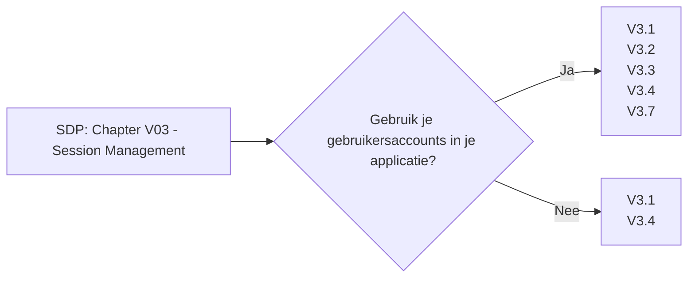

# Chapter V03 - Session Management

Het hoofdstuk "V03 - Session Management" van de SDP gaat over het veilig beheren van gebruikerssessies in je applicatie. Het zorgt ervoor dat, zodra iemand is ingelogd, hun sessie veilig blijft en niet gekaapt kan worden door anderen.

Bijvoorbeeld:

* **Unieke Sessies**: Elke gebruiker krijgt een unieke sessie-ID die moeilijk te raden is.
* **Sessie Beveiliging**: Sessie-ID's worden veilig bewaard en verstuurd, bijvoorbeeld door ze te versleutelen en alleen via HTTPS te versturen.
* **Sessie Tijdslimieten**: Stel tijdslimieten in voor sessies, zodat gebruikers automatisch worden uitgelogd na een periode van inactiviteit.
* **Sessie Invalideren**: Zorg ervoor dat sessies worden beëindigd wanneer gebruikers uitloggen, en dat gestolen sessies snel ongeldig gemaakt kunnen worden.

Dit hoofdstuk helpt je om gebruikerssessies veilig te beheren, zodat kwaadwillenden geen toegang kunnen krijgen tot de accounts van andere gebruikers.

Om te controleren of dit hoofdstuk van toepassing is op jouw project, gebruik deze workflow:

## V3.1 Fundamental Session Management Security

### Baseline

Voor meer informatie zie: [V3.1 Fundamental Session Management Security](./V3.1%20Fundamental%20Session%20Management%20Security.md)

| ID    | Description |
| ----- | ----------- |
| 3.1.1 | Verify the application never reveals session tokens in URL parameters. |

### Enhanced

Dit item heeft geen Level 2 items.

### Advanced

Dit item heeft geen Level 3 items.

## V3.2 Session Binding

### Baseline

Voor meer informatie zie: [V3.2 Session Binding](./V3.2%20Session%20Binding.md)

| ID    | Description |
| ----- | ----------- |
| 3.2.1 | Verify the application generates a new session token on user authentication. |
| 3.2.2 | Verify that session tokens possess at least 64 bits of entropy. |
| 3.2.3 | Verify the application only stores session tokens in the browser using secure methods such as appropriately secured cookies (see section 3.4) or HTML 5 session storage. |

### Enhanced

| ID    | Description |
| ----- | ----------- |
| 3.2.4 | Verify that session tokens are generated using approved cryptographic algorithms. |

### Advanced

Dit item heeft geen Level 3 items.

## V3.3 Session Termination

### Baseline

Voor meer informatie zie: [V3.3 Session Termination](./V3.3%20Session%20Termination.MD)

| ID    | Description |
| ----- | ----------- |
| 3.3.1 | Verify that logout and expiration invalidate the session token, such that the back button or a downstream relying party does not resume an authenticated session, including across relying parties. |
| 3.3.2 | If authenticators permit users to remain logged in, verify that re-authentication occurs periodically both when actively used or after an idle period. |

### Enhanced

| ID    | Description |
| ----- | ----------- |
| 3.3.3 | Verify that the application gives the option to terminate all other active sessions after a successful password change (including change via password reset/recovery), and that this is effective across the application, federated login (if present), and any relying parties. |
| 3.3.4 | Verify that users are able to view and (having re-entered login credentials) log out of any or all currently active sessions and devices. |

### Advanced

Dit item heeft geen Level 3 items.

## V3.4 Cookie-based Session Management

### Baseline

Voor meer informatie zie: [V3.4 Cookie-based Session Management](./V3.4%20Cookie-based%20Session%20Management.md)

| ID    | Description |
| ----- | ----------- |
| 3.4.1 | Verify that cookie-based session tokens have the 'Secure' attribute set. |
| 3.4.2 | Verify that cookie-based session tokens have the 'HttpOnly' attribute set. |
| 3.4.3 | Verify that cookie-based session tokens utilize the 'SameSite' attribute to limit exposure to cross-site request forgery attacks. |
| 3.4.4 | Verify that cookie-based session tokens use the "__Host-" prefix so cookies are only sent to the host that initially set the cookie. |
| 3.4.5 | Verify that if the application is published under a domain name with other applications that set or use session cookies that might disclose the session cookies, set the path attribute in cookie-based session tokens using the most precise path possible. |

### Enhanced

Dit item heeft geen Level 2 items.

### Advanced

Dit item heeft geen Level 3 items.

## V3.5 Token-based Session Management

### Baseline

Dit item heeft geen Level 1 items.

### Enhanced

| ID    | Description |
| ----- | ----------- |
| 3.5.1 | Verify the application allows users to revoke OAuth tokens that form trust relationships with linked applications. |
| 3.5.2 | Verify the application uses session tokens rather than static API secrets and keys, except with legacy implementations. |
| 3.5.3 | Verify that stateless session tokens use digital signatures, encryption, and other countermeasures to protect against tampering, enveloping, replay, null cipher, and key substitution attacks. |

### Advanced

Dit item heeft geen Level 3 items.

## V3.6 Federated Re-authentication

### Baseline

Dit item heeft geen Level 1 items.

### Enhanced

Dit item heeft geen Level 2 items.

### Advanced

| ID    | Description |
| ----- | ----------- |
| 3.6.1 | Verify that Relying Parties (RPs) specify the maximum authentication time to Credential Service Providers (CSPs) and that CSPs re-authenticate the user if they haven't used a session within that period. |
| 3.6.2 | Verify that Credential Service Providers (CSPs) inform Relying Parties (RPs) of the last authentication event, to allow RPs to determine if they need to re-authenticate the user. |

## V3.7 Defenses Against Session Management Exploits

### Baseline

Voor meer informatie zie: [V3.7 Defenses Against Session Management Exploits](./V3.7%20Defenses%20Against%20Session%20Management%20Exploits.md)

| ID    | Description |
| ----- | ----------- |
| 3.7.1 | Verify the application ensures a full, valid login session or requires re-authentication or secondary verification before allowing any sensitive transactions or account modifications. |

### Enhanced

Dit item heeft geen Level 2 items.

### Advanced

Dit item heeft geen Level 3 items
