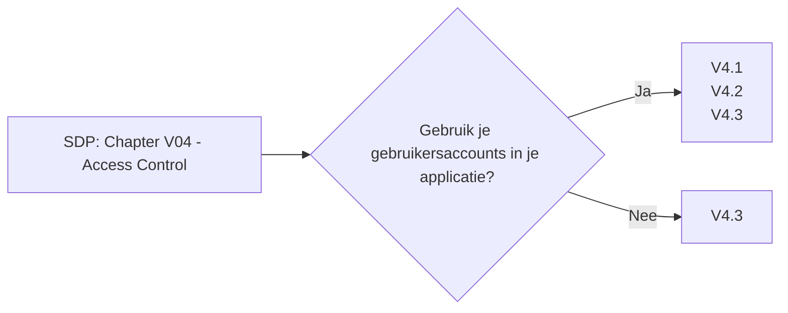

# Chapter V04 - Access Control

Het hoofdstuk "V04 - Access Control" van de SDP gaat over het regelen wie toegang heeft tot welke onderdelen van je applicatie. Het zorgt ervoor dat gebruikers alleen kunnen doen wat ze mogen doen, en niet meer.

Wat voorbeelden:

* **Rechten Toekennen**: Bepaal welke acties verschillende gebruikersrollen mogen uitvoeren.
* **Minimale Toegang**: Geef gebruikers alleen de toegangsrechten die ze echt nodig hebben, niet meer.
* **Toegang Controleren**: Controleer bij elke actie of de gebruiker daar echt toestemming voor heeft.
* **Regelmatige Evaluatie**: Evalueer regelmatig de toegangsrechten om te zorgen dat ze nog steeds kloppen met wat gebruikers nodig hebben.

Dit hoofdstuk helpt je om de toegang tot je applicatie goed te beheren, zodat gebruikers alleen kunnen doen wat ze mogen doen en beveiligingsrisico's worden geminimaliseerd.

Om te controleren of dit hoofdstuk van toepassing is op jouw project, gebruik deze workflow:

## V4.1 General Access Control Design

### Baseline

Voor meer informatie zie: [V4.1 General Access Control Design](./V4.1%20General%20Access%20Control%20Design.md)

| ID    | Description |
| ----- | ----------- |
| 4.1.1 | Verify that the application enforces access control rules on a trusted service layer, especially if client-side access control is present and could be bypassed. |
| 4.1.2 | Verify that all user and data attributes and policy information used by access controls cannot be manipulated by end users unless specifically authorized. |
| 4.1.3 | Verify that the principle of least privilege exists - users should only be able to access functions, data files, URLs, controllers, services, and other resources, for which they possess specific authorization. This implies protection against spoofing and elevation of privilege. |
| 4.1.5 | Verify that access controls fail securely including when an exception occurs. |

### Enhanced

Dit item heeft geen Level 2 items.

### Advanced

Dit item heeft geen Level 3 items.

## V4.2 Operation Level Access Control

### Baseline

Voor meer informatie zie: [V4.2 Operation Level Access Control](./V4.2%20Operation%20Level%20Access%20Control%20Design.md)

| ID    | Description |
| ----- | ----------- |
| 4.2.1 | Verify that sensitive data and APIs are protected against Insecure Direct Object Reference (IDOR) attacks targeting creation, reading, updating and deletion of records, such as creating or updating someone else's record, viewing everyone's records, or deleting all records. |
| 4.2.2 | Verify that the application or framework enforces a strong anti-CSRF mechanism to protect authenticated functionality, and effective anti-automation or anti-CSRF protects unauthenticated functionality. |

### Enhanced

Dit item heeft geen Level 2 items.

### Advanced

Dit item heeft geen Level 3 items.

## V4.3 Other Access Control Considerations

### Baseline

Voor meer informatie zie: [V4.3 Other Access Control Considerations](./V4.3%20Other%20Access%20Control%20Considerations.md)

| ID    | Description |
| ----- | ----------- |
| 4.3.1 | Verify administrative interfaces use appropriate multi-factor authentication to prevent unauthorized use. |
| 4.3.2 | Verify that directory browsing is disabled unless deliberately desired. Additionally, applications should not allow discovery or disclosure of file or directory metadata, such as Thumbs.db, .DS_Store, .git or .svn folders. |

### Enhanced

| ID    | Description |
| ----- | ----------- |
| 4.3.3 | Verify the application has additional authorization (such as step up or adaptive authentication) for lower value systems, and / or segregation of duties for high value applications to enforce anti-fraud controls as per the risk of application and past fraud. |

### Advanced

Dit item heeft geen Level 3 items.
