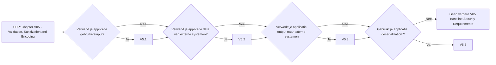

# Chapter V05 - Validation, Sanitization and Encoding

Het hoofdstuk "V05 - Validation, Sanitization and Encoding" van de SDP gaat over het veilig verwerken van gegevens die je applicatie binnenkomen en verlaten. Het helpt voorkomen dat kwaadaardige gegevens schade aanrichten.

Je kan hierbij denken aan:

* **Invoer Validatie**: Controleer of alle gegevens die de applicatie binnenkomen voldoen aan de verwachte formaten en waarden.
* **Gegevens Sanitatie**: Maak gegevens schoon door schadelijke inhoud te verwijderen voordat je ze verwerkt of opslaat.
* **Uitvoer Codering**: Codeer gegevens correct voordat je ze weer naar de gebruiker stuurt om te voorkomen dat ze schadelijke scripts bevatten.

Dit hoofdstuk helpt je om ervoor te zorgen dat je applicatie veilig omgaat met gegevens, zodat gebruikers geen schadelijke invoer kunnen gebruiken om je systeem aan te vallen.

Om te controleren of dit hoofdstuk van toepassing is op jouw project, gebruik deze workflow:

## V5.1 Input Validation

### Baseline

Voor meer informatie zie: [V5.1 Input Validation](./V5.1%20Input%20Validation.md)

| ID    | Description |
| ----- | ----------- |
| 5.1.1 | Verify that the application has defenses against HTTP parameter pollution attacks, particularly if the application framework makes no distinction about the source of request parameters (GET, POST, cookies, headers, or environment variables). |
| 5.1.2 | Verify that frameworks protect against mass parameter assignment attacks, or that the application has countermeasures to protect against unsafe parameter assignment, such as marking fields private or similar. |
| 5.1.3 | Verify that all input (HTML form fields, REST requests, URL parameters, HTTP headers, cookies, batch files, RSS feeds, etc) is validated using positive validation (allow lists). |
| 5.1.4 | Verify that structured data is strongly typed and validated against a defined schema including allowed characters, length and pattern (e.g. credit card numbers, e-mail addresses, telephone numbers, or validating that two related fields are reasonable, such as checking that suburb and zip/postcode match). |
| 5.1.5 | Verify that URL redirects and forwards only allow destinations which appear on an allow list, or show a warning when redirecting to potentially untrusted content. |

### Enhanced

Dit item heeft geen Level 2 items.

### Advanced

Dit item heeft geen Level 3 items.

## V5.2 Sanitization and Sandboxing

### Baseline

Voor meer informatie zie: [V5.2 Sanitization and Sandboxing](./V5.2%20Sanitization%20and%20Sandboxing.md)

| ID    | Description |
| ----- | ----------- |
| 5.2.1 | Verify that all untrusted HTML input from WYSIWYG editors or similar is properly sanitized with an HTML sanitizer library or framework feature. |
| 5.2.2 | Verify that unstructured data is sanitized to enforce safety measures such as allowed characters and length. |
| 5.2.3 | Verify that the application sanitizes user input before passing to mail systems to protect against SMTP or IMAP injection. |
| 5.2.4 | Verify that the application avoids the use of eval() or other dynamic code execution features. Where there is no alternative, any user input being included must be sanitized or sandboxed before being executed. |
| 5.2.5 | Verify that the application protects against template injection attacks by ensuring that any user input being included is sanitized or sandboxed. |
| 5.2.6 | Verify that the application protects against SSRF attacks, by validating or sanitizing untrusted data or HTTP file metadata, such as filenames and URL input fields, and uses allow lists of protocols, domains, paths and ports. |
| 5.2.7 | Verify that the application sanitizes, disables, or sandboxes user-supplied Scalable Vector Graphics (SVG) scriptable content, especially as they relate to XSS resulting from inline scripts, and foreignObject. |
| 5.2.8 | Verify that the application sanitizes, disables, or sandboxes user-supplied scriptable or expression template language content, such as Markdown, CSS or XSL stylesheets, BBCode, or similar. |

### Enhanced

Dit item heeft geen Level 2 items.

### Advanced

Dit item heeft geen Level 3 items.

## V5.3 Output Encoding and Injection Prevention

### Baseline

Voor meer informatie zie: [V5.3 Output Encoding and Injection Prevention](./V5.3%20Output%20Encoding%20and%20Injection%20Prevention.md)

| ID    | Description |
| ----- | ----------- |
| 5.3.1 | Verify that output encoding is relevant for the interpreter and context required. For example, use encoders specifically for HTML values, HTML attributes, JavaScript, URL parameters, HTTP headers, SMTP, and others as the context requires, especially from untrusted inputs (e.g. names with Unicode or apostrophes, such as ねこ or O'Hara). |
| 5.3.2 | Verify that output encoding preserves the user's chosen character set and locale, such that any Unicode character point is valid and safely handled. |
| 5.3.3 | Verify that context-aware, preferably automated - or at worst, manual - output escaping protects against reflected, stored, and DOM based XSS. |
| 5.3.4 | Verify that data selection or database queries (e.g. SQL, HQL, ORM, NoSQL) use parameterized queries, ORMs, entity frameworks, or are otherwise protected from database injection attacks. |
| 5.3.5 | Verify that where parameterized or safer mechanisms are not present, context-specific output encoding is used to protect against injection attacks, such as the use of SQL escaping to protect against SQL injection. |
| 5.3.6 | Verify that the application protects against JSON injection attacks, JSON eval attacks, and JavaScript expression evaluation. |
| 5.3.7 | Verify that the application protects against LDAP injection vulnerabilities, or that specific security controls to prevent LDAP injection have been implemented. |
| 5.3.8 | Verify that the application protects against OS command injection and that operating system calls use parameterized OS queries or use contextual command line output encoding. |
| 5.3.9 | Verify that the application protects against Local File Inclusion (LFI) or Remote File Inclusion (RFI) attacks. |
| 5.3.10 | Verify that the application protects against XPath injection or XML injection attacks. |

### Enhanced

Dit item heeft geen Level 2 items.

### Advanced

Dit item heeft geen Level 3 items.

## V5.4 Memory, String, and Unmanaged Code

### Baseline

Dit item heeft geen Level 1 items.

### Enhanced

| ID    | Description |
| ----- | ----------- |
| 5.4.1 | Verify that the application uses memory-safe string, safer memory copy and pointer arithmetic to detect or prevent stack, buffer, or heap overflows. |
| 5.4.2 | Verify that format strings do not take potentially hostile input, and are constant. |
| 5.4.3 | Verify that sign, range, and input validation techniques are used to prevent integer overflows. |

### Advanced

Dit item heeft geen Level 3 items.

## V5.5 Deserialization Prevention

Voor meer informatie zie: [V5.5 Deserialization Prevention](./V5.5%20Deserialization%20Prevention.md)

### Baseline

| ID    | Description |
| ----- | ----------- |
| 5.5.1 | Verify that serialized objects use integrity checks or are encrypted to prevent hostile object creation or data tampering. |
| 5.5.2 | Verify that the application correctly restricts XML parsers to only use the most restrictive configuration possible and to ensure that unsafe features such as resolving external entities are disabled to prevent XML eXternal Entity (XXE) attacks. |
| 5.5.3 | Verify that deserialization of untrusted data is avoided or is protected in both custom code and third-party libraries (such as JSON, XML and YAML parsers). |
| 5.5.4 | Verify that when parsing JSON in browsers or JavaScript-based backends, JSON.parse is used to parse the JSON document. Do not use eval() to parse JSON. |

### Enhanced

Dit item heeft geen Level 2 items.

### Advanced

Dit item heeft geen Level 3 items.
