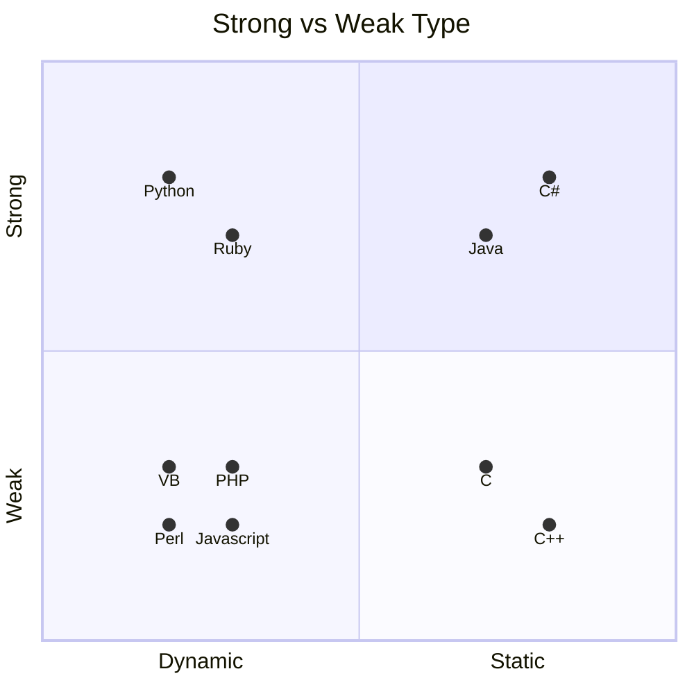

# V5.1 Input Validation

## 5.1.1 Verify that the application has defenses against HTTP parameter pollution attacks, particularly if the application framework makes no distinction about the source of request parameters (GET, POST, cookies, headers, or environment variables)

Bij parameter polution worden de HTTP waardes zo bewerkt dat deze invloed hebben op de functionaliteit server side zonder dat dit zichtbaar, of minimaal zichtbaar is voor een gebruiker. Denk hierbij aan het toevoegen, bijwerken of manipuleren van de HTTP headers. Op <https://book.hacktricks.xyz/pentesting-web/parameter-pollution> kan meer informatie worden gevonden over deze aanval.

### Hoe te testen?

#### Optie 1 (via Pentest)

Vraag een Pentest aan.

#### Optie 2 (via SAST)

Gebruik een SAST tool om mogelijke plekken van HTTP parameter pollution op te sporen.

### Hoe te implementeren?

Volg best practices en gebruik de nieuwste versie van het gekozen framework.

## 5.1.2 Verify that frameworks protect against mass parameter assignment attacks, or that the application has countermeasures to protect against unsafe parameter assignment, such as marking fields private or similar

Door het verkeerd programmeren van getters en setters is het mogelijk dat, via het meesturen van variabelen, deze waarde alsnog worden ingesteld. Bijvoorbeeld door de waarde ?is_admin=true mee te sturen bij het aanmaken van een gebruiker kan de code deze input overnemen zonder dat deze als functionaliteit normaal is ontsloten, dit komt omdat getters en setters vaak enkel de logica van de input volgen.

Code voorbeelden zijn te vinden op: <https://cheatsheetseries.owasp.org/cheatsheets/Mass_Assignment_Cheat_Sheet.html>

### Hoe te testen?

#### Optie 1 (via code)

1. Definieer welke getters en setters er in de code beschikbaar zijn.
2. Manipuleer een POST verzoek waar al deze waardes worden geüpdatet.
3. Kijk naar de resultaten.

#### Optie 2 (via Pentest)

1. Definieer welke getters en setters er in de code beschikbaar zijn.
2. Vraag een Pentest aan.
3. Deel deze waardes met de Pentesters.

#### Optie 3 (via SAST)

Gebruik een SAST tool om mogelijk verkeerd geprogrammeerde getters en setters te herkennen.

### Hoe te implementeren?

Volg de best practices beschreven in <https://cheatsheetseries.owasp.org/cheatsheets/Mass_Assignment_Cheat_Sheet.html>

## 5.1.3 Verify that all input (HTML form fields, REST requests, URL parameters, HTTP headers, cookies, batch files, RSS feeds, etc) is validated using positive validation (allow lists)

Door het gebruik van allow lists oftewel positieve validatie, is het mogelijk om te controleren of input voldoet aan de verwacht input. Hierbij kun je spreken over syntactische en semantische validatie; syntactische validatie moet een correcte syntax van gestructureerde velden afdwingen (bijv. BSN, datum, valutasymbool). Semantische validatie moet de juistheid van hun waarden afdwingen in de specifieke bedrijfscontext (bijv. startdatum is voor einddatum, prijs is binnen verwachte bereik).

### Hoe te testen?

#### Optie 1 (via Pentest)

Vraag een Pentest aan.

#### Optie 1 (via SAST)

Gebruik een SAST tool met input filters die controleert of input via een allow list werkt.

### Hoe te implementeren?

Volg de best practices beschreven in <https://cheatsheetseries.owasp.org/cheatsheets/Input_Validation_Cheat_Sheet.html>

## 5.1.4 Verify that structured data is strongly typed and validated against a defined schema including allowed characters, length and pattern (e.g. credit card numbers, e-mail addresses, telephone numbers, or validating that two related fields are reasonable, such as checking that suburb and zip/postcode match)

Het is afhankelijk van de taal en framework of deze strongly typed is. Een voorbeeld is dat je bijvoorbeeld niet een integer mag delen door een string. In sommige talen of frameworks kan dit wel zonder dat de compiler hier over klaagt. Hierdoor kunnen er logica fouten ontstaan die misbruikt kunnen worden door aanvallers.

Verder kan door het gebruik van bijvoorbeeld regex worden gedefinieerd hoe input eruit moet zien. Hierdoor is het dan ook niet mogelijk als aanvaller om input te geven die afwijkt van de verwacht input, waardoor de aanvalsoppervlakte verkleint. Hierbij is het belangrijk dat deze check ook gebeurd op de server side.

### Hoe te testen?

#### Optie 1 (manueel)

1. Controleer of de programmeertaal aan strong typing doet.
2. Indexeer waardes waar je een strong type verwacht.
3. Implementeer Regex checks om de strong type te forceren.

#### Optie 2 (via Pentest)

Vraag een Pentest aan.

### Hoe te implementeren?

Omdat het afhankelijk is van je framework / taal, is de keuze hierin belangrijk.

## 5.1.5 Verify that URL redirects and forwards only allow destinations which appear on an allow list, or show a warning when redirecting to potentially untrusted content

Wanneer een gebruiker wordt doorgestuurd naar externe bronnen is het belangrijk dat de gebruiker hiervan op de hoogte is. Daarom dient er ofwel een waarschuwing te worden gegeven als een redirect naar een externe bron plaats vindt, of een lijst opgesteld te worden van websites waar naar doorgelinkt mag worden. Deze lijst dient vervolgens gebruikt te worden als verificatie alvorens een gebruiker wordt doorgestuurd.

### Hoe te testen?

#### Optie 1 (manueel)

1. Indexeer welke externe bronnen benaderd mogen worden.
2. Klik op een link die verwijst naar een externe bron niet in deze lijst.
3. Kijk of er een waarschuwing of blokkade wordt getoond.

### Hoe te implementeren?

Volg de best practices beschreven in <https://cheatsheetseries.owasp.org/cheatsheets/Unvalidated_Redirects_and_Forwards_Cheat_Sheet.html#preventing-unvalidated-redirects-and-forwards>
