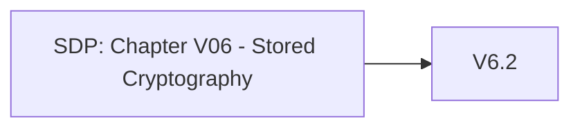

# Chapter V06 - Stored Cryptography

Het hoofdstuk "V06 - Stored Cryptography" van de SDP richt zich op het veilig gebruiken en beheren van cryptografische technieken en sleutels voor gegevens die je applicatie opslaat. Dit helpt om gevoelige informatie te beschermen tegen onbevoegde toegang en manipulatie.

Een aantal voorbeelden:

* **Sterke Cryptografische Algoritmen**: Gebruik bewezen, sterke cryptografische algoritmen en vermijd verouderde of zwakke methoden.
* **Sleutelbeheer**: Beheer cryptografische sleutels op een veilige manier, bijvoorbeeld door gebruik te maken van een sleutelbeheerder (HSM of KMS).
* **Versleuteling van Gevoelige Gegevens**: Zorg ervoor dat gevoelige gegevens, zoals wachtwoorden en persoonlijke informatie, altijd versleuteld worden opgeslagen.
* **Sleutelrotatie**: Implementeer beleid voor sleutelrotatie, zodat sleutels regelmatig worden vernieuwd om de beveiliging te verbeteren.
* **Toegangscontrole**: Beperk de toegang tot cryptografische sleutels en versleutelde gegevens tot alleen bevoegde gebruikers en systemen.

Dit hoofdstuk helpt je om cryptografie op een veilige en effectieve manier toe te passen in je applicatie, zodat gevoelige gegevens goed beschermd zijn tegen onbevoegde toegang en andere bedreigingen.

Om te controleren of dit hoofdstuk van toepassing is op jouw project, gebruik deze workflow:

## V6.1 Data Classification

### Baseline

Dit item heeft geen Level 1 items.

### Enhanced

| ID    | Description |
| ----- | ----------- |
| 6.1.1 | Verify that regulated private data is stored encrypted while at rest, such as Personally Identifiable Information (PII), sensitive personal information, or data assessed likely to be subject to EU's GDPR. |
| 6.1.2 | Verify that regulated health data is stored encrypted while at rest, such as medical records, medical device details, or de-anonymized research records. |
| 6.1.3 | Verify that regulated financial data is stored encrypted while at rest, such as financial accounts, defaults or credit history, tax records, pay history, beneficiaries, or de-anonymized market or research records. |

### Advanced

Dit item heeft geen Level 3 items.

## V6.2 Algorithms

### Baseline

Voor meer informatie zie: [V6.2 Algorithms](./V6.2%20Algorithms.md)

| ID    | Description |
| ----- | ----------- |
| 6.2.1 | Verify that all cryptographic modules fail securely, and errors are handled in a way that does not enable Padding Oracle attacks. |

### Enhanced

| ID    | Description |
| ----- | ----------- |
| 6.2.2 | Verify that industry proven or government approved cryptographic algorithms, modes, and libraries are used, instead of custom coded cryptography. |
| 6.2.3 | Verify that encryption initialization vector, cipher configuration, and block modes are configured securely using the latest advice. |
| 6.2.4 | Verify that random number, encryption or hashing algorithms, key lengths, rounds, ciphers or modes, can be reconfigured, upgraded, or swapped at any time, to protect against cryptographic breaks. |
| 6.2.5 | Verify that known insecure block modes (i.e. ECB, etc.), padding modes (i.e. PKCS#1 v1.5, etc.), ciphers with small block sizes (i.e. Triple-DES, Blowfish, etc.), and weak hashing algorithms (i.e. MD5, SHA1, etc.) are not used unless required for backwards compatibility. |
| 6.2.6 | Verify that nonces, initialization vectors, and other single use numbers must not be used more than once with a given encryption key. The method of generation must be appropriate for the algorithm being used. |

### Advanced

| ID    | Description |
| ----- | ----------- |
| 6.2.7 | Verify that encrypted data is authenticated via signatures, authenticated cipher modes, or HMAC to ensure that ciphertext is not altered by an unauthorized party. |
| 6.2.8 | Verify that all cryptographic operations are constant-time, with no 'short-circuit' operations in comparisons, calculations, or returns, to avoid leaking information. |

## V6.3 Random Values

### Baseline

Dit item heeft geen Level 1 items.

### Enhanced

| ID    | Description |
| ----- | ----------- |
| 6.3.1 | Verify that all random numbers, random file names, random GUIDs, and random strings are generated using the cryptographic module's approved cryptographically secure random number generator when these random values are intended to be not guessable by an attacker. |
| 6.3.2 | Verify that random GUIDs are created using the GUID v4 algorithm, and a Cryptographically-secure Pseudo-random Number Generator (CSPRNG). GUIDs created using other pseudo-random number generators may be predictable. |

### Advanced

| ID    | Description |
| ----- | ----------- |
| 6.3.3 | Verify that random numbers are created with proper entropy even when the application is under heavy load, or that the application degrades gracefully in such circumstances. |

## V6.4 Secret Management

### Baseline

Dit item heeft geen Level 1 items.

### Enhanced

| ID    | Description |
| ----- | ----------- |
| 6.4.1 | Verify that a secrets management solution such as a key vault is used to securely create, store, control access to and destroy secrets. |
| 6.4.2 | Verify that key material is not exposed to the application but instead uses an isolated security module like a vault for cryptographic operations. |

### Advanced

Dit item heeft geen Level 3 items.
