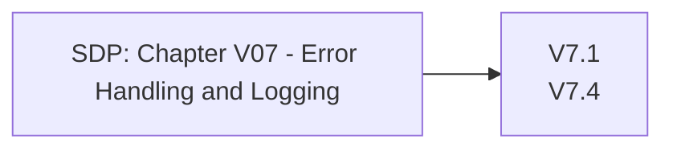

# Chapter V07 - Error Handling and Logging

Het hoofdstuk "V07 - Error Handling and Logging" van de SDP gaat over het veilig omgaan met fouten en het effectief loggen van gebeurtenissen in je applicatie. Dit helpt om problemen te identificeren zonder gevoelige informatie bloot te stellen en zorgt voor een goede basis voor incidentrespons.

Denk hierbij aan het volgende:

* **Veilige Foutmeldingen**: Zorg ervoor dat foutmeldingen geen gevoelige informatie onthullen die door aanvallers misbruikt kan worden.
* **Gedetailleerde Logging**: Log relevante gebeurtenissen en fouten, zodat je later problemen kunt analyseren en oplossen.
* **Bescherming van Logbestanden**: Beveilig logbestanden tegen ongeautoriseerde toegang en zorg dat ze alleen toegankelijk zijn voor bevoegde personen.
* **Consistente Foutafhandeling**: Gebruik een consistente aanpak voor het afhandelen van fouten om voorspelbaarheid en veiligheid te waarborgen.
* **Monitoring**: Houd de logs continu in de gaten om verdachte activiteiten snel te kunnen detecteren en daarop te reageren.

Dit hoofdstuk helpt je om veilig en effectief om te gaan met fouten en logs, zodat je problemen kunt oplossen zonder de beveiliging van je applicatie in gevaar te brengen.

Om te controleren of dit hoofdstuk van toepassing is op jouw project, gebruik deze workflow:

## V7.1 Log Content

### Baseline

Voor meer informatie zie: [V7.1 Log Content](./V7.1%20Log%20Content.md)

| ID    | Description |
| ----- | ----------- |
| 7.1.1 | Verify that the application does not log credentials or payment details. Session tokens should only be stored in logs in an irreversible, hashed form. |
| 7.1.2 | Verify that the application does not log other sensitive data as defined under local privacy laws or relevant security policy. |

### Enhanced

| ID    | Description |
| ----- | ----------- |
| 7.1.3 | Verify that the application logs security relevant events including successful and failed authentication events, access control failures, deserialization failures and input validation failures. |
| 7.1.4 | Verify that each log event includes necessary information that would allow for a detailed investigation of the timeline when an event happens. |

### Advanced

Dit item heeft geen Level 3 items.

## V7.2 Log Processing

### Baseline

Dit item heeft geen Level 1 items.

### Enhanced

| ID    | Description |
| ----- | ----------- |
| 7.2.1 | Verify that all authentication decisions are logged, without storing sensitive session tokens or passwords. This should include requests with relevant metadata needed for security investigations. |
| 7.2.2 | Verify that all access control decisions can be logged and all failed decisions are logged. This should include requests with relevant metadata needed for security investigations. |

### Advanced

Dit item heeft geen Level 3 items.

## V7.3 Log Protection

### Baseline

Dit item heeft geen Level 1 items.

### Enhanced

| ID    | Description |
| ----- | ----------- |
| 7.3.1 | Verify that all logging components appropriately encode data to prevent log injection. |
| 7.3.3 | Verify that security logs are protected from unauthorized access and modification. |
| 7.3.4 | Verify that time sources are synchronized to the correct time and time zone. Strongly consider logging only in UTC if systems are global to assist with post-incident forensic analysis. |

### Advanced

Dit item heeft geen Level 3 items.

## V7.4 Error Handling

### Baseline

Voor meer informatie zie: [V7.4 Error Handling](./V7.4%20Error%20Handling.md)

| ID    | Description |
| ----- | ----------- |
| 7.4.1 | Verify that a generic message is shown when an unexpected or security sensitive error occurs, potentially with a unique ID which support personnel can use to investigate. |

### Enhanced

| ID    | Description |
| ----- | ----------- |
| 7.4.2 | Verify that exception handling (or a functional equivalent) is used across the codebase to account for expected and unexpected error conditions. |
| 7.4.3 | Verify that a "last resort" error handler is defined which will catch all unhandled exceptions. |

### Advanced

Dit item heeft geen Level 3 items.
