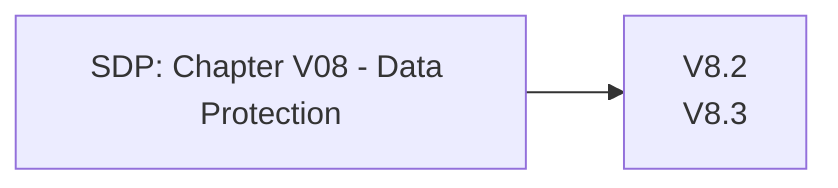

# Chapter V08 - Data Protection

Het hoofdstuk "V08 - Data Protection" van de SDP gaat over het beschermen van gevoelige gegevens in je applicatie, zowel tijdens opslag als tijdens overdracht. Dit helpt om te voorkomen dat gegevens worden blootgesteld aan onbevoegde toegang of diefstal.

Korte samenvatting:

* **Gegevensversleuteling**: Versleutel gevoelige gegevens, zowel wanneer ze worden opgeslagen (data-at-rest) als wanneer ze worden verzonden (data-in-transit), om ervoor te zorgen dat alleen bevoegde partijen toegang hebben.
* **Gevoelige Gegevens Minimaliseren**: Verzamel, bewaar en verwerk alleen de gegevens die je echt nodig hebt om de kans op blootstelling te minimaliseren.
* **Beveiligingsmaatregelen**: Implementeer sterke beveiligingsmaatregelen, zoals toegangscontroles en auditing, om gevoelige gegevens te beschermen tegen onbevoegde toegang.
* **Gegevensmaskering**: Gebruik technieken zoals gegevensmaskering en tokenisatie om de blootstelling van gevoelige informatie te verminderen.
* **Gegevensverwijdering**: Zorg voor veilige en effectieve methoden om gegevens te verwijderen wanneer ze niet langer nodig zijn.

Dit hoofdstuk helpt je om gevoelige gegevens in je applicatie goed te beschermen, zodat ze veilig blijven tegen ongeautoriseerde toegang en andere bedreigingen.

Om te controleren of dit hoofdstuk van toepassing is op jouw project, gebruik deze workflow:

## V8.1 General Data Protection

### Baseline

Dit item heeft geen Level 1 items.

### Enhanced

| ID    | Description |
| ----- | ----------- |
| 8.1.1 | Verify the application protects sensitive data from being cached in server components such as load balancers and application caches. |
| 8.1.2 | Verify that all cached or temporary copies of sensitive data stored on the server are protected from unauthorized access or purged/invalidated after the authorized user accesses the sensitive data. |
| 8.1.3 | Verify the application minimizes the number of parameters in a request, such as hidden fields, Ajax variables, cookies and header values. |
| 8.1.4 | Verify the application can detect and alert on abnormal numbers of requests, such as by IP, user, total per hour or day, or whatever makes sense for the application. |

### Advanced

| ID    | Description |
| ----- | ----------- |
| 8.1.5 | Verify that regular backups of important data are performed and that test restoration of data is performed. |
| 8.1.6 | Verify that backups are stored securely to prevent data from being stolen or corrupted. |

## V8.2 Client-side Data Protection

### Baseline

Voor meer informatie zie: [V8.2 Client-side Data Protection](./V8.2%20Client-side%20Data%20Protection.md)

| ID    | Description |
| ----- | ----------- |
| 8.2.1 | Verify the application sets sufficient anti-caching headers so that sensitive data is not cached in modern browsers. |
| 8.2.2 | Verify that data stored in browser storage (such as localStorage, sessionStorage, IndexedDB, or cookies) does not contain sensitive data. |
| 8.2.3 | Verify that authenticated data is cleared from client storage, such as the browser DOM, after the client or session is terminated. |

### Enhanced

Dit item heeft geen Level 2 items.

### Advanced

Dit item heeft geen Level 3 items.

## V8.3 Sensitive Private Data

### Baseline

Voor meer informatie zie: [V8.3 Sensitive Private Data](./V8.3%20Sensitive%20Private%20Data.md)

| ID    | Description |
| ----- | ----------- |
| 8.3.1 | Verify that sensitive data is sent to the server in the HTTP message body or headers, and that query string parameters from any HTTP verb do not contain sensitive data. |
| 8.3.2 | Verify that users have a method to remove or export their data on demand. |
| 8.3.3 | Verify that users are provided clear language regarding collection and use of supplied personal information and that users have provided opt-in consent for the use of that data before it is used in any way. |
| 8.3.4 | Verify that all sensitive data created and processed by the application has been identified, and ensure that a policy is in place on how to deal with sensitive data. |

### Enhanced

| ID    | Description |
| ----- | ----------- |
| 8.3.5 | Verify accessing sensitive data is audited (without logging the sensitive data itself), if the data is collected under relevant data protection directives or where logging of access is required. |
| 8.3.6 | Verify that sensitive information contained in memory is overwritten as soon as it is no longer required to mitigate memory dumping attacks, using zeroes or random data. |
| 8.3.7 | Verify that sensitive or private information that is required to be encrypted, is encrypted using approved algorithms that provide both confidentiality and integrity. |
| 8.3.8 | Verify that sensitive personal information is subject to data retention classification, such that old or out of date data is deleted automatically, on a schedule, or as the situation requires. |

### Advanced

Dit item heeft geen Level 3 items.
