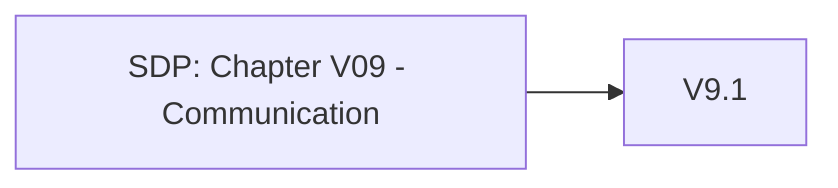

# Chapter V09 - Communication

Het hoofdstuk "V09 - Communication" van de SDP gaat over het beveiligen van de communicatiekanalen die je applicatie gebruikt. Dit zorgt ervoor dat gegevens veilig worden uitgewisseld tussen gebruikers, systemen en services.

Denk aan:

* **Versleuteling**: Gebruik sterke versleuteling (zoals TLS) voor alle gegevens die over netwerken worden verzonden om te voorkomen dat ze worden onderschept of gewijzigd.
* **Certificaatbeheer**: Zorg ervoor dat je SSL/TLS-certificaten correct zijn geïnstalleerd, bijgewerkt en veilig worden beheerd.
* **Beveiligde Protocollen**: Gebruik alleen veilige communicatieprotocollen en vermijd verouderde of onveilige versies.
* **Authenticatie en Autorisatie**: Verifieer en autoriseer zowel de client- als de serverkant om ervoor te zorgen dat alleen geautoriseerde partijen met elkaar communiceren.
* **Integriteit van Gegeven**s: Zorg ervoor dat gegevens tijdens de overdracht niet kunnen worden gewijzigd zonder detectie.

Dit hoofdstuk helpt je om veilige communicatiekanalen op te zetten en te onderhouden, zodat gegevens veilig en betrouwbaar kunnen worden uitgewisseld.

Om te controleren of dit hoofdstuk van toepassing is op jouw project, gebruik deze workflow:

## V9.1 Client Communication Security

### Baseline

Voor meer informatie zie: [V9.1 Client Communication Security](./V9.1%20Client%20Communication%20Security.md)

| ID    | Description |
| ----- | ----------- |
| 9.1.1 | Verify that TLS is used for all client connectivity, and does not fall back to insecure or unencrypted communications. |
| 9.1.2 | Verify using up to date TLS testing tools that only strong cipher suites are enabled, with the strongest cipher suites set as preferred. |
| 9.1.3 | Verify that only the latest recommended versions of the TLS protocol are enabled, such as TLS 1.2 and TLS 1.3. The latest version of the TLS protocol should be the preferred option. |

### Enhanced

Dit item heeft geen Level 2 items.

### Advanced

Dit item heeft geen Level 3 items.

## V9.2 Server Communication Security

### Baseline

Dit item heeft geen Level 1 items.

### Enhanced

| ID    | Description |
| ----- | ----------- |
| 9.2.1 | Verify that connections to and from the server use trusted TLS certificates. Where internally generated or self-signed certificates are used, the server must be configured to only trust specific internal CAs and specific self-signed certificates. All others should be rejected. |
| 9.2.2 | Verify that encrypted communications such as TLS is used for all inbound and outbound connections, including for management ports, monitoring, authentication, API, or web service calls, database, cloud, serverless, mainframe, external, and partner connections. The server must not fall back to insecure or unencrypted protocols. |
| 9.2.3 | Verify that all encrypted connections to external systems that involve sensitive information or functions are authenticated. |
| 9.2.4 | Verify that proper certification revocation, such as Online Certificate Status Protocol (OCSP) Stapling, is enabled and configured. |

### Advanced

| ID    | Description |
| ----- | ----------- |
| 9.2.5 | Verify that backend TLS connection failures are logged. |
