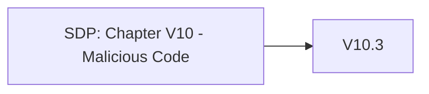

# Chapter V10 - Malicious Code

Het hoofdstuk "V10 - Malicious Code" van de SDP richt zich op het voorkomen, detecteren en beheersen van kwaadaardige code binnen je applicatie. Dit helpt om je applicatie te beschermen tegen schadelijke software en code-injectieaanvallen.

Wat voorbeelden:

* **Code Review**: Voer regelmatige codebeoordelingen uit om kwaadaardige of kwetsbare code te identificeren en te verwijderen.
* **Gebruik Beveiligde Bibliotheken**: Gebruik alleen vertrouwde en beveiligde bibliotheken en frameworks om het risico op ingebouwde kwetsbaarheden te verminderen.
* **Input Validatie**: Valideer alle invoer om te voorkomen dat schadelijke gegevens je systeem binnendringen en uitgevoerd worden.
* **Beveiligingstests**: Voer beveiligingstests uit, zoals statische en dynamische analyse, om kwetsbaarheden in de code op te sporen.
* **Monitoring en Incident Response**: Houd de applicatie continu in de gaten op tekenen van kwaadaardige activiteiten en zorg voor een snelle reactie op incidenten.

Dit hoofdstuk helpt je om ervoor te zorgen dat je applicatie vrij blijft van kwaadaardige code en dat je snel kunt reageren als er toch iets verdachts gebeurt.

Om te controleren of dit hoofdstuk van toepassing is op jouw project, gebruik deze workflow:

## V10.1 Code Integrity

### Baseline

Dit item heeft geen Level 1 items.

### Enhanced

Dit item heeft geen Level 2 items.

### Advanced

| ID     | Description |
| ------ | ----------- |
| 10.1.1 | Verify that a code analysis tool is in use that can detect potentially malicious code, such as time functions, unsafe file operations and network connections. |

## V10.2 Malicious Code Search

### Baseline

Dit item heeft geen Level 1 items.

### Enhanced

| ID     | Description |
| ------ | ----------- |
| 10.2.1 | Verify that the application source code and third party libraries do not contain unauthorized phone home or data collection capabilities. Where such functionality exists, obtain the user's permission for it to operate before collecting any data. |
| 10.2.2 | Verify that the application does not ask for unnecessary or excessive permissions to privacy related features or sensors, such as contacts, cameras, microphones, or location. |

### Advanced

| ID     | Description |
| ------ | ----------- |
| 10.2.3 | Verify that the application source code and third party libraries do not contain back doors, such as hard-coded or additional undocumented accounts or keys, code obfuscation, undocumented binary blobs, rootkits, or anti-debugging, insecure debugging features, or otherwise out of date, insecure, or hidden functionality that could be used maliciously if discovered. |
| 10.2.4 | Verify that the application source code and third party libraries do not contain time bombs by searching for date and time related functions. |
| 10.2.5 | Verify that the application source code and third party libraries do not contain malicious code, such as salami attacks, logic bypasses, or logic bombs. |
| 10.2.6 | Verify that the application source code and third party libraries do not contain Easter eggs or any other potentially unwanted functionality. |

## V10.3 Application Integrity

### Baseline

Voor meer informatie zie: [V10.3 Application Integrity](./V10.3%20Application%20Integrity.md)

| ID     | Description |
| ------ | ----------- |
| 10.3.1 | Verify that if the application has a client or server auto-update feature, updates should be obtained over secure channels and digitally signed. The update code must validate the digital signature of the update before installing or executing the update. |
| 10.3.2 | Verify that the application employs integrity protections, such as code signing or subresource integrity. The application must not load or execute code from untrusted sources, such as loading includes, modules, plugins, code, or libraries from untrusted sources or the Internet. |
| 10.3.3 | Verify that the application has protection from subdomain takeovers if the application relies upon DNS entries or DNS subdomains, such as expired domain names, out of date DNS pointers or CNAMEs, expired projects at public source code repos, or transient cloud APIs, serverless functions, or storage buckets (*autogen-bucket-id*.cloud.example.com) or similar. Protections can include ensuring that DNS names used by applications are regularly checked for expiry or change. |

### Enhanced

Dit item heeft geen Level 2 items.

### Advanced

Dit item heeft geen Level 3 items.
