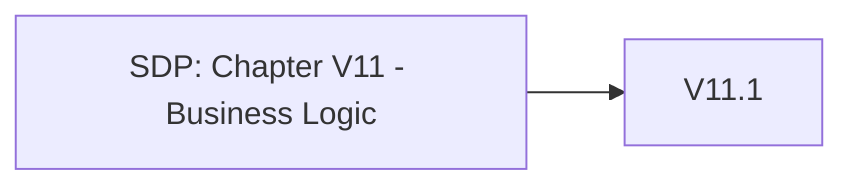

# Chapter V11 - Business Logic

Het hoofdstuk "V11 - Business Logic" van de SDP richt zich op het beveiligen van de bedrijfslogica in je applicatie. Dit zijn de regels en processen die bepalen hoe je applicatie functioneert en welke acties gebruikers kunnen ondernemen.

Denk aan het volgende:

* **Regels Valideren**: Zorg ervoor dat alle bedrijfsregels goed zijn geïmplementeerd en niet kunnen worden omzeild door kwaadwillende gebruikers.
* **Ongewenste Acties Voorkomen**: Voorkom dat gebruikers ongeoorloofde acties kunnen uitvoeren die de werking of integriteit van je applicatie kunnen verstoren.
* **Controlemechanismen**: Implementeer controles om misbruik van functies te detecteren en te voorkomen, zoals bijvoorbeeld dubbele transacties of frauduleuze activiteiten.
* **Consistente Logica**: Zorg ervoor dat de bedrijfslogica consistent en betrouwbaar werkt, ongeacht de invoer of omstandigheden.

Dit hoofdstuk helpt je om de kernprocessen van je applicatie te beveiligen, zodat gebruikers alleen kunnen doen wat ze mogen doen en de integriteit van je systeem behouden blijft.

Om te controleren of dit hoofdstuk van toepassing is op jouw project, gebruik deze workflow:

## V11.1 Business Logic Security

### Baseline

Voor meer informatie zie: [V11.1 Business Logic Security](./V11.1%20Business%20Logic%20Security.md)

| ID     | Description |
| ------ | ----------- |
| 11.1.1 | Verify that the application will only process business logic flows for the same user in sequential step order and without skipping steps. |
| 11.1.2 | Verify that the application will only process business logic flows with all steps being processed in realistic human time, i.e. transactions are not submitted too quickly. |
| 11.1.3 | Verify the application has appropriate limits for specific business actions or transactions which are correctly enforced on a per user basis. |
| 11.1.4 | Verify that the application has anti-automation controls to protect against excessive calls such as mass data exfiltration, business logic requests, file uploads or denial of service attacks. |
| 11.1.5 | Verify the application has business logic limits or validation to protect against likely business risks or threats, identified using threat modeling or similar methodologies. |

### Enhanced

| ID     | Description |
| ------ | ----------- |
| 11.1.6 | Verify that the application does not suffer from "Time Of Check to Time Of Use" (TOCTOU) issues or other race conditions for sensitive operations. |
| 11.1.7 | Verify that the application monitors for unusual events or activity from a business logic perspective. For example, attempts to perform actions out of order or actions which a normal user would never attempt. |
| 11.1.8 | Verify that the application has configurable alerting when automated attacks or unusual activity is detected. |

### Advanced

Dit item heeft geen Level 3 items.
