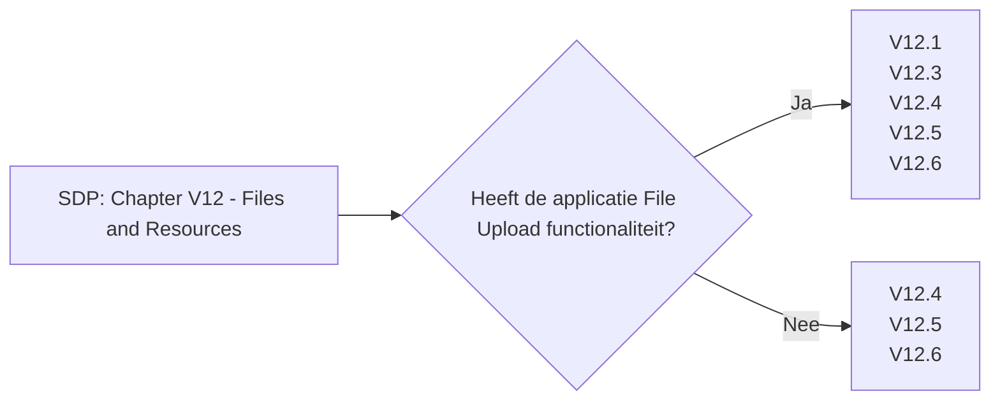

# Chapter V12 - Files and Resources

Het hoofdstuk "V12 - Bestanden en Middelen" van de SDP gaat over het veilig omgaan met bestanden en andere bronnen die je applicatie gebruikt. Het helpt je te beschermen tegen bedreigingen die voortkomen uit het openen, opslaan of delen van bestanden.

Korte samenvatting:

* **Gegevensvalidatie**: Controleer en valideer alle bestanden die je applicatie binnenkomen om te voorkomen dat schadelijke inhoud wordt geüpload.
* **Veilige Opslag**: Sla bestanden op een veilige manier op, bijvoorbeeld door ze te versleutelen, zodat gevoelige gegevens beschermd zijn tegen onbevoegde toegang.
* **Beperkingen op Bestanden**: Sta alleen veilige en noodzakelijke bestandstypen toe om risico's te minimaliseren.
* **Toegangsbeheer**: Beperk de toegang tot bestanden en andere bronnen, zodat alleen geautoriseerde gebruikers en systemen er toegang toe hebben.
* **Logging en Monitoring**: Houd bij wie bestanden uploadt, downloadt en wijzigt om verdachte activiteiten te kunnen detecteren en onderzoeken.

Dit hoofdstuk helpt je om bestanden en andere bronnen in je applicatie veilig te beheren en te beschermen tegen aanvallen en ongeautoriseerde toegang.

Om te controleren of dit hoofdstuk van toepassing is op jouw project, gebruik deze workflow:

## V12.1 File Upload

### Baseline

Voor meer informatie zie: [V12.1 File Upload](./V12.1%20File%20Upload.md)

| ID     | Description |
| ------ | ----------- |
| 12.1.1 | Verify that the application will not accept large files that could fill up storage or cause a denial of service. |

### Enhanced

| ID     | Description |
| ------ | ----------- |
| 12.1.2 | Verify that the application checks compressed files (e.g. zip, gz, docx, odt) against maximum allowed uncompressed size and against maximum number of files before uncompressing the file. |
| 12.1.3 | Verify that a file size quota and maximum number of files per user is enforced to ensure that a single user cannot fill up the storage with too many files, or excessively large files. |

### Advanced

Dit item heeft geen Level 3 items.

## V12.2 File Integrity

### Baseline

Dit item heeft geen Level 1 items.

### Enhanced

| ID     | Description |
| ------ | ----------- |
| 12.2.1 | Verify that files obtained from untrusted sources are validated to be of expected type based on the file's content. |

### Advanced

Dit item heeft geen Level 3 items.

## V12.3 File Execution

### Baseline

Voor meer informatie zie: [V12.3 File Execution](./V12.3%20File%20Execution.md)

| ID     | Description |
| ------ | ----------- |
| 12.3.1 | Verify that user-submitted filename metadata is not used directly by system or framework filesystems and that a URL API is used to protect against path traversal. |
| 12.3.2 | Verify that user-submitted filename metadata is validated or ignored to prevent the disclosure, creation, updating or removal of local files (LFI). |
| 12.3.3 | Verify that user-submitted filename metadata is validated or ignored to prevent the disclosure or execution of remote files via Remote File Inclusion (RFI) or Server-side Request Forgery (SSRF) attacks. |
| 12.3.4 | Verify that the application protects against Reflective File Download (RFD) by validating or ignoring user-submitted filenames in a JSON, JSONP, or URL parameter, the response Content-Type header should be set to text/plain, and the Content-Disposition header should have a fixed filename. |
| 12.3.5 | Verify that untrusted file metadata is not used directly with system API or libraries, to protect against OS command injection. |

### Enhanced

| ID     | Description |
| ------ | ----------- |
| 12.3.6 | Verify that the application does not include and execute functionality from untrusted sources, such as unverified content distribution networks, JavaScript libraries, node npm libraries, or server-side DLLs. |

### Advanced

Dit item heeft geen Level 3 items.

## V12.4 File Storage

### Baseline

Voor meer informatie zie: [V12.4 File Storage](./V12.4%20File%20Storage.md)

| ID     | Description |
| ------ | ----------- |
| 12.4.1 | Verify that files obtained from untrusted sources are stored outside the web root, with limited permissions. |
| 12.4.2 | Verify that files obtained from untrusted sources are scanned by antivirus scanners to prevent upload and serving of known malicious content. |

### Enhanced

Dit item heeft geen Level 2 items.

### Advanced

Dit item heeft geen Level 3 items.

## V12.5 File Download

### Baseline

Voor meer informatie zie: [V12.5 File Download](./V12.5%20File%20Download.md)

| ID     | Description |
| ------ | ----------- |
| 12.5.1 | Verify that the web tier is configured to serve only files with specific file extensions to prevent unintentional information and source code leakage. For example, backup files (e.g. .bak), temporary working files (e.g. .swp), compressed files (.zip, .tar.gz, etc) and other extensions commonly used by editors should be blocked unless required. |
| 12.5.2 | Verify that direct requests to uploaded files will never be executed as HTML/JavaScript content. |

### Enhanced

Dit item heeft geen Level 2 items.

### Advanced

Dit item heeft geen Level 3 items.

## V12.6 SSRF Protection

### Baseline

Voor meer informatie zie: [V12.6 SSRF Protection](./V12.6%20SSRF%20Protection.md)

| ID     | Description |
| ------ | ----------- |
| 12.6.1 | Verify that the web or application server is configured with an allow list of resources or systems to which the server can send requests or load data/files from. |

### Enhanced

Dit item heeft geen Level 2 items.

### Advanced

Dit item heeft geen Level 3 items.
