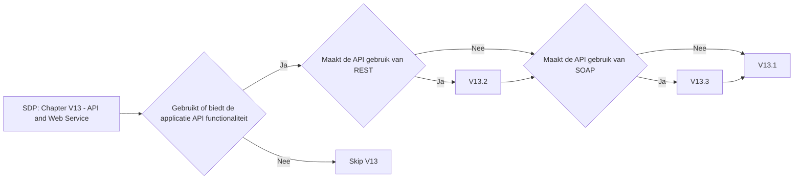

# Chapter V13 - API and Web Service

Het hoofdstuk "V13 - API en Web Service" van de SDP gaat over het beveiligen van API's en webservices die je applicatie gebruikt of aanbiedt. Het zorgt ervoor dat gegevensuitwisseling tussen verschillende systemen veilig gebeurt.

Onder andere moet je denken aan:

* **Toegang Beheersen**: Zorg ervoor dat alleen geautoriseerde gebruikers en systemen toegang hebben tot je API's.
* **Gegevens Beschermen**: Versleutel gegevens die via API's en webservices worden verzonden om te voorkomen dat ze worden onderschept of gemanipuleerd.
* **Invoer Validatie**: Controleer en filter alle gegevens die je API ontvangt om te voorkomen dat schadelijke invoer je systeem binnendringt.
* **Beveiligde Authenticatie**: Gebruik sterke authenticatiemethoden, zoals tokens en certificaten, om de identiteit van gebruikers en systemen te verifiëren.
* **Logging en Monitoring**: Houd bij wie toegang heeft tot je API's en wat ze doen, zodat je verdachte activiteiten kunt detecteren en onderzoeken.

Dit hoofdstuk helpt je om ervoor te zorgen dat je API's en webservices veilig zijn en dat de communicatie tussen systemen betrouwbaar en beschermd is tegen aanvallen.

Om te controleren of dit hoofdstuk van toepassing is op jouw project, gebruik deze workflow:

## V13.1 Generic Web Service Security

### Baseline

Voor meer informatie zie: [V13.1 Generic Web Service Security](./V13.1%20Generic%20Web%20Service%20Security.md)

| ID     | Description |
| ------ | ----------- |
| 13.1.1 | Verify that all application components use the same encodings and parsers to avoid parsing attacks that exploit different URI or file parsing behavior that could be used in SSRF and RFI attacks. |
| 13.1.3 | Verify API URLs do not expose sensitive information, such as the API key, session tokens etc. |

### Enhanced

| ID     | Description |
| ------ | ----------- |
| 13.1.4 | Verify that authorization decisions are made at both the URI, enforced by programmatic or declarative security at the controller or router, and at the resource level, enforced by model-based permissions. |
| 13.1.5 | Verify that requests containing unexpected or missing content types are rejected with appropriate headers (HTTP response status 406 Unacceptable or 415 Unsupported Media Type). |

### Advanced

Dit item heeft geen Level 3 items.

## V13.2 RESTful Web Service

### Baseline

Voor meer informatie zie: [V13.2 RESTful Web Service](./V13.2%20RESTful%20Web%20Service.md)

| ID     | Description |
| ------ | ----------- |
| 13.2.1 | Verify that enabled RESTful HTTP methods are a valid choice for the user or action, such as preventing normal users using DELETE or PUT on protected API or resources. |
| 13.2.2 | Verify that JSON schema validation is in place and verified before accepting input. |
| 13.2.3 | Verify that RESTful web services that utilize cookies are protected from Cross-Site Request Forgery via the use of at least one or more of the following: double submit cookie pattern, CSRF nonces, or Origin request header checks. |

### Enhanced

| ID     | Description |
| ------ | ----------- |
| 13.2.5 | Verify that REST services explicitly check the incoming Content-Type to be the expected one, such as application/xml or application/json. |
| 13.2.6 | Verify that the message headers and payload are trustworthy and not modified in transit. Requiring strong encryption for transport (TLS only) may be sufficient in many cases as it provides both confidentiality and integrity protection. Per-message digital signatures can provide additional assurance on top of the transport protections for high-security applications but bring with them additional complexity and risks to weigh against the benefits. |

### Advanced

Dit item heeft geen Level 3 items.

## V13.3 SOAP Web Service

### Baseline

Voor meer informatie zie: [V13.3 SOAP Web Service](./V13.3%20SOAP%20Web%20Service.md)

| ID     | Description |
| ------ | ----------- |
| 13.3.1 | Verify that XSD schema validation takes place to ensure a properly formed XML document, followed by validation of each input field before any processing of that data takes place. |

### Enhanced

| ID     | Description |
| ------ | ----------- |
| 13.3.2 | Verify that the message payload is signed using WS-Security to ensure reliable transport between client and service. |

### Advanced

Dit item heeft geen Level 3 items.

## V13.4 GraphQL

### Baseline

Dit item heeft geen Level 1 items.

### Enhanced

| ID     | Description |
| ------ | ----------- |
| 13.4.1 | Verify that a query allow list or a combination of depth limiting and amount limiting is used to prevent GraphQL or data layer expression Denial of Service (DoS) as a result of expensive, nested queries. For more advanced scenarios, query cost analysis should be used. |
| 13.4.2 | Verify that GraphQL or other data layer authorization logic should be implemented at the business logic layer instead of the GraphQL layer. |

### Advanced

Dit item heeft geen Level 3 items.
