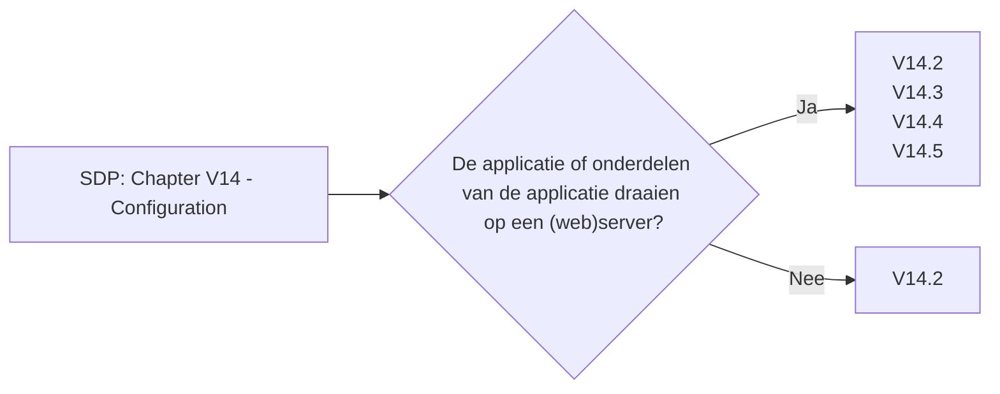

# Chapter V14 - Configuration

Het hoofdstuk "V14 - Configuratie" van de SDP gaat over het veilig instellen en beheren van de configuraties van je applicatie en infrastructuur. Het zorgt ervoor dat je instellingen zo zijn ingericht dat ze de veiligheid van je applicatie verbeteren.

Het betekent:

* **Veilige Standaardinstellingen**: Zorg ervoor dat de standaardinstellingen veilig zijn, zodat je niet per ongeluk een kwetsbare configuratie hebt.
* **Configuratiebeheer**: Gebruik tools en processen om configuraties centraal te beheren en consistent toe te passen.
* **Gevoelige Gegevens Beschermen**: Bewaar gevoelige configuratiegegevens, zoals API-sleutels en wachtwoorden, veilig en versleuteld.
* **Regelmatige Evaluaties**: Controleer en update regelmatig je configuraties om te zorgen dat ze nog steeds voldoen aan de beste beveiligingspraktijken.

Dit hoofdstuk helpt je om je configuraties zo in te stellen dat je applicatie veilig blijft, en dat je gemakkelijk aanpassingen kunt maken zonder de beveiliging in gevaar te brengen.

Om te controleren of dit hoofdstuk van toepassing is op jouw project, gebruikt deze workflow:

## V14.1 Build and Deploy

### Baseline

Dit item heeft geen Level 1 items.

### Enhanced

| ID     | Description |
| ------ | ----------- |
| 14.1.1 | Verify that the application build and deployment processes are performed in a secure and repeatable way, such as CI / CD automation, automated configuration management, and automated deployment scripts. |
| 14.1.2 | Verify that compiler flags are configured to enable all available buffer overflow protections and warnings, including stack randomization, data execution prevention, and to break the build if an unsafe pointer, memory, format string, integer, or string operations are found. |
| 14.1.3 | Verify that server configuration is hardened as per the recommendations of the application server and frameworks in use. |
| 14.1.4 | Verify that the application, configuration, and all dependencies can be re-deployed using automated deployment scripts, built from a documented and tested runbook in a reasonable time, or restored from backups in a timely fashion. |

### Advanced

| ID     | Description |
| ------ | ----------- |
| 14.1.5 | Verify that authorized administrators can verify the integrity of all security-relevant configurations to detect tampering. |

## V14.2 Dependency

### Baseline

Voor meer informatie zie: [V14.2 Dependency](./V14.2%20Dependency.md)

| ID     | Description |
| ------ | ----------- |
| 14.2.1 | Verify that all components are up to date, preferably using a dependency checker during build or compile time. |
| 14.2.2 | Verify that all unneeded features, documentation, sample applications and configurations are removed. |
| 14.2.3 | Verify that if application assets, such as JavaScript libraries, CSS or web fonts, are hosted externally on a Content Delivery Network (CDN) or external provider, Subresource Integrity (SRI) is used to validate the integrity of the asset. |

### Enhanced

| ID     | Description |
| ------ | ----------- |
| 14.2.4 | Verify that third party components come from pre-defined, trusted and continually maintained repositories. |
| 14.2.5 | Verify that a Software Bill of Materials (SBOM) is maintained of all third party libraries in use. |
| 14.2.6 | Verify that the attack surface is reduced by sandboxing or encapsulating third party libraries to expose only the required behaviour into the application. |

### Advanced

Dit item heeft geen Level 3 items.

## V14.3 Unintended Security Disclosure

### Baseline

Voor meer informatie zie: [V14.3 Unintended Security Disclosure](./V14.3%20Unintended%20Security%20Disclosure.md)

| ID     | Description |
| ------ | ----------- |
| 14.3.2 | Verify that web or application server and application framework debug modes are disabled in production to eliminate debug features, developer consoles, and unintended security disclosures. |
| 14.3.3 | Verify that the HTTP headers or any part of the HTTP response do not expose detailed version information of system components. |

### Enhanced

Dit item heeft geen Level 2 items.

### Advanced

Dit item heeft geen Level 3 items.

## V14.4 HTTP Security Headers

### Baseline

Voor meer informatie zie: [V14.4 HTTP Security Headers](./V14.4%20HTTP%20Security%20Headers.md)

| ID     | Description |
| ------ | ----------- |
| 14.4.1 | Verify that every HTTP response contains a Content-Type header. Also specify a safe character set (e.g., UTF-8, ISO-8859-1) if the content types are text/*, /+xml and application/xml. Content must match with the provided Content-Type header. |
| 14.4.2 | Verify that all API responses contain a Content-Disposition: attachment; filename="api.json" header (or other appropriate filename for the content type). |
| 14.4.3 | Verify that a Content Security Policy (CSP) response header is in place that helps mitigate impact for XSS attacks like HTML, DOM, JSON, and JavaScript injection vulnerabilities. |
| 14.4.4 | Verify that all responses contain a X-Content-Type-Options: nosniff header. |
| 14.4.5 | Verify that a Strict-Transport-Security header is included on all responses and for all subdomains, such as Strict-Transport-Security: max-age=15724800; includeSubdomains. |
| 14.4.6 | Verify that a suitable Referrer-Policy header is included to avoid exposing sensitive information in the URL through the Referer header to untrusted parties. |
| 14.4.7 | Verify that the content of a web application cannot be embedded in a third-party site by default and that embedding of the exact resources is only allowed where necessary by using suitable Content-Security-Policy: frame-ancestors and X-Frame-Options response headers. |

### Enhanced

Dit item heeft geen Level 2 items.

### Advanced

Dit item heeft geen Level 3 items.

## V14.5 HTTP Request Header Validation

### Baseline

Voor meer informatie zie: [V14.5 HTTP Request Header Validation](./V14.5%20HTTP%20Request%20Header%20Validation.md)

| ID     | Description |
| ------ | ----------- |
| 14.5.1 | Verify that the application server only accepts the HTTP methods in use by the application/API, including pre-flight OPTIONS, and logs/alerts on any requests that are not valid for the application context. |
| 14.5.2 | Verify that the supplied Origin header is not used for authentication or access control decisions, as the Origin header can easily be changed by an attacker. |
| 14.5.3 | Verify that the Cross-Origin Resource Sharing (CORS) Access-Control-Allow-Origin header uses a strict allow list of trusted domains and subdomains to match against and does not support the "null" origin. |

### Enhanced

| ID     | Description |
| ------ | ----------- |
| 14.5.4 | Verify that HTTP headers added by a trusted proxy or SSO devices, such as a bearer token, are authenticated by the application. |

### Advanced

Dit item heeft geen Level 3 items.
