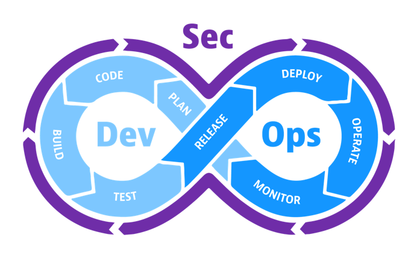
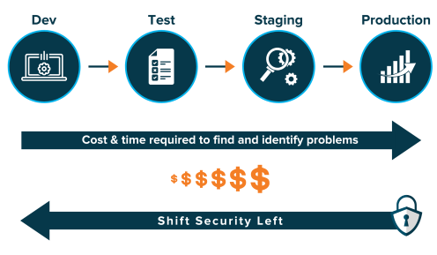
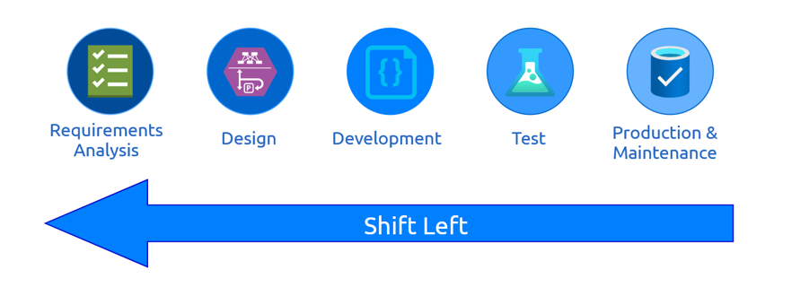

# Secure Development

This page explains our approach to Secure Development, based on the PowerPoint presentation developed by the Security Team.

## What is Secure Development?

Secure Development involves integrating security into every phase of the software development process, from initial planning and design to coding, testing, and maintenance.

It focuses on proactively identifying and addressing vulnerabilities, making security an integral part of the workflow rather than an afterthought.
Through collaboration between the Security Team and Development Teams, we aim to create a robust Secure Development Lifecycle.

## Why Secure Development?

* **Data Protection**: Safeguard sensitive information and prevent data breaches
* **Regulatory Compliance**: Adhere to industry standards (e.g., BIO) and avoid legal penalties
* **Customer Trust & Reputation**: Build and maintain customer confidence by ensuring their data is secure

## Shift Left in Security

* **Proactive Approach**: Integrate security measures early in the development process
* **Early Detection**: Identify and resolve vulnerabilities before they become costly
* **Continuous Improvement**: Use regular updates and feedback loops to enhance security

## Key Challenges

* Security often feels "evidence-based":
  * Involves a lot of manual work
  * Can feel like an audit process
* Security can be perceived as restrictive:
  * Known as the "Department of No."
  * Imposed by people who don’t use the systems directly
* Security often seems abstract:
  * Policies, standards, and requirements
  * Subject to varied interpretations
* Where to start?
  * The Secure Development Pathway serves as a starting point!

## Our Collaborative Approach

* **Partnership**: Collaborate with teams to integrate security at every stage
* **Support**: Provide ongoing assistance for security-related questions
* **Education**: Conduct regular workshops to share best practices and highlight the value of security measures
* **Focus**: Align team efforts. Security culture takes precedence, with tools as secondary support

## Security Liaisons (DevSecOps Engineers)

* Security Liaisons act as the bridge between security experts and development teams:
  * They guide Product Owners and developers on integrating security measures from the start and throughout the development process
  * This simplifies compliance with security standards such as the BIO or ISO27001
* Involving Security Liaisons enables teams to:
  * **Understand Secure Development Guidelines**: Gain clarity on required security measures by following established guidelines
  * **Early Integration**: Embed security practices at the beginning of the development cycle instead of adding them at the end
  * **Continuous Support**: Ensure all security aspects are addressed throughout the project lifecycle
  * **Simplified Compliance**: Make security a natural part of the development workflow, easing adherence to security requirements

## This Approach Enables Us to Focus On

* **Flexibility**: Avoid rigid checklists by tailoring the approach to team needs
* **Compliance**: Following Secure Development guidelines inherently aligns with compliance
* **Security Baseline**: Establish a clear target for both compliance and security awareness within teams
* **Transparency**: Clear Secure Development guidelines define expectations for developers and the role of Security Liaisons
* **Security by Design**: Build a measurable and demonstrable approach to security through the Secure Development guidelines

## When to Apply Secure Development Guidelines

The Secure Development guidelines can be followed at any stage. However, their nature (Shift Left) makes the optimal time to implement them right after the design phase, as development begins.

It is also possible to focus on specific aspects of the guidelines, such as only implementing sections like "Access Control" or "Authentication" from frameworks like OWASP ASVS. However, applying a comprehensive set of guidelines where applicable ensures measurable progress toward compliance and the overall security of your application.

Consider revisiting the guidelines after major application changes, new sprints, or updates.
