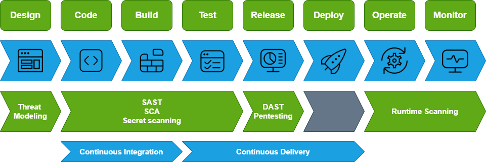

# Vulnerability Management - Explanation in the DevSecOps Context

This document describes the Security Testing in your CI/CD environment. We'll cover SAST, DAST, SCA and Vulnerability scanning.

A quick overview of the location of the different testing in your CI/CD environment:

## SAST

SAST, or Static Application Security Testing, examines your source code for security vulnerabilities without executing the program. It's like a code review that automatically checks for potential security flaws in your custom code.

Short summary of what a SAST tool does:

* Examines source code for security vulnerabilities without running the code
* Refers to Custom Code that is unique to your application instead of 3rd party or open-source components
* Some of the things a SAST can check for:
  * Bugs: Detecting coding errors that could lead to unexpected behavior
  * Vulnerabilities: Identifying security flaws in your code, such as injections or insecure configurations
  * Code Smells: Finding maintainability issues that could make your code hard to understand or prone to errors
  * Duplications: Checking for duplicate code blocks, which can make maintenance more difficult

### Examples of SAST Tooling

* SonarCloud / SonarQube
* Snyk Code
* Checkmarx
* Semgrep

### Important pointers on SAST

* Lives inside CI/CD pipelines
* Input as linter in IDE (a linter is a tool that analyzes code for errors, style issues, and potential bugs in an Integrated Developer Environment)
* Focuses on custom code; the code that your developers write
* Does not necessarily do anything with dependencies / libraries
* Especially important for early-stage detection to prevent vulnerabilities from entering the main codebase

## DAST

DAST, or Dynamic Application Security Testing, is different from SAST. While SAST analyzes the static code, DAST tests the running application. It simulates attacks on the application in its live environment to find vulnerabilities like SQL injection, Cross-Site Scripting, and other runtime issues. DAST is like an external hacker trying to find weaknesses in your application while it's running.

Short summary of what a DAST tool checks for:

* SQL Injection
* Code Injection
* Cross-Site Scripting
* Authentication and Server configuration errors

### Examples of DAST Tooling

* Dastardly
* OWASP ZAP
* Burp Suite
* AppSpider

### Important pointers on DAST

* Can run both inside and outside your environment
* Kind of like an automated hacker trying to break stuff
* Focuses on Web Applications

## SCA

SCA, or Software Composition Analysis, focuses on analyzing the open-source components and libraries in your codebase to identify known vulnerabilities. Think of it as a way to keep track of the ingredients in your software recipe or the equivalent to knowing all the parts that are in a car and where they are manufactured.

An SCA can do a BUNCH of stuff. Keep in mind that it focuses on open-source components and libraries. SCA tools usually check for the following:

* Known vulnerabilities
* License compliance
* Outdated dependencies (version checking)
* Dependency trees
* Component Metadata (details about a software component, like its name, version, license type, origin, and usage)
* Risk scores
* Remediation Suggestions (suggested fixes)

### Examples of SCA tooling

* Dependency Track
* Aquasec Trivy
* Snyk (Snyk Open Source)
* GitHub Dependabot (only checks for outdated dependencies)
* JFrog Xray

### Important pointers on SCA

* Lives inside CI/CD pipelines
* Focuses on open-source components and libraries (dependencies)
* Especially important for early-stage detection to prevent vulnerabilities from entering the main codebase

## Vulnerability Scanners

A Vulnerability Scanner is similar to DAST in that it performs assessments on a live system, scanning for known vulnerabilities in network services and applications. However, while DAST focuses on web applications, vulnerability scanners have a broader scope, targeting various network services and operating systems. It’s mostly a tool for broader vulnerability management.

A VERY (really, a very) short summary of what these tools can do:

* Scanning: Detects vulnerabilities in systems, networks, and applications
* Assessment: Analyzes detected issues for severity and impact
* Reporting: Generates detailed reports on found vulnerabilities and remediation steps
* Monitoring: Continuously scans and updates vulnerability data to track new issues
* Remediation Guidance: Provides recommendations for fixing identified vulnerabilities
* Compliance Checks: Verifies adherence to security standards and policies such as the CIS benchmark

### Examples of Vulnerability Scanners

* Nessus
* OpenVAS (part of Greenbone Vulnerability Management)
* QualysGuard
* Rapid7 Nexpose

### Important Pointers on Vulnerability Scanners

* Usually lives externally of your environment, running it’s checks on your publicly available web applications
* If configured can also scan internal machines using system accounts to verify configuration and installed software
* Does NOT only focus on Web Applications but is a much broader vulnerability management solution
